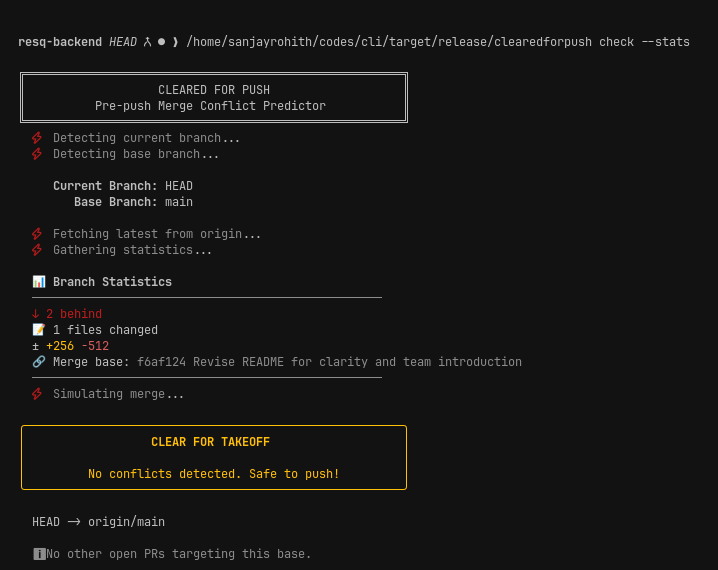
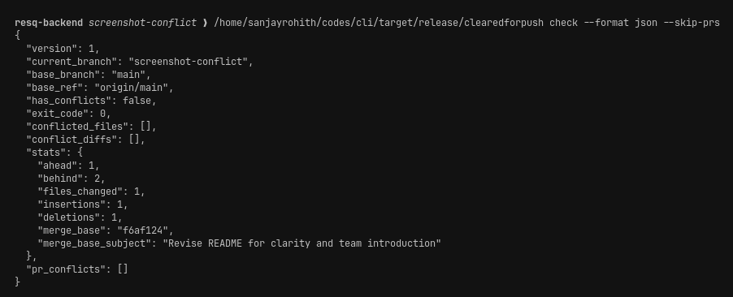
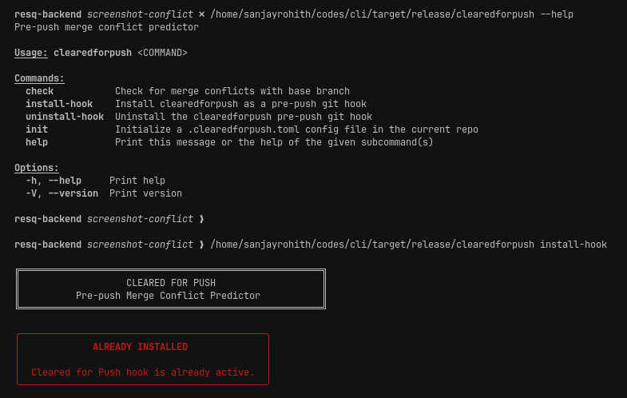
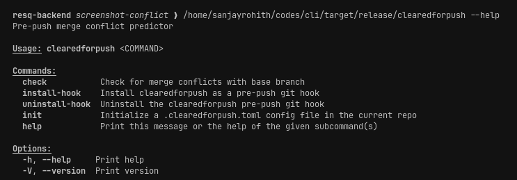

<div align="center">

<h1>✈ &nbsp;C L E A R E D &nbsp;&nbsp; F O R &nbsp;&nbsp; P U S H</h1>

<h3><i>Know before you push.</i></h3>

**Catch merge conflicts _before_ you push** &mdash; not during CI, not in PR review,<br/>not when your teammate pings you at 5 p.m.

<br/>

[](https://crates.io/crates/clearedforpush)
[](#-license)
[](https://www.rust-lang.org)
[](https://git-scm.com)

<br/>

<a href="#-quick-start"><b>Quick Start</b></a>&nbsp;&nbsp;·&nbsp;&nbsp;
<a href="#-how-it-works"><b>How It Works</b></a>&nbsp;&nbsp;·&nbsp;&nbsp;
<a href="#-installation"><b>Install</b></a>&nbsp;&nbsp;·&nbsp;&nbsp;
<a href="#-usage"><b>Usage</b></a>&nbsp;&nbsp;·&nbsp;&nbsp;
<a href="#-configuration"><b>Config</b></a>

<br/>



</div>

<br/>

<div align="center">

```
━━━━━━━━━━━━━━━━━━━━━━━━━━━━━━━━━━━━━━━━━━━━━━━━━━━━━━━━━━━━━━━━━━━━━━━
```

</div>

## ▸ &nbsp;The Problem

Every developer knows this pain:

```console
$ git push origin feature-branch
  ✓ Pushed! Time for coffee ☕

  ... 20 minutes later ...

  ✗ CI failed: merge conflicts in 4 files
  ✗ Or worse — your reviewer finds them
  ✗ Or worse still — you discover them mid-rebase
```

By the time conflicts surface, **you've lost all context.** The code is cold, the CI queue is
backed up, and a teammate is blocked. A 2-minute fix becomes a 30-minute detour.

<br/>

## ▸ &nbsp;The Solution

> **Cleared for Push tells you the moment a conflict exists — _before_ you push.**

<table>
<tr>
<td width="50%" valign="top">

**✓ &nbsp;All clear**

```
╭──────────────────────────────╮
│      CLEAR FOR TAKEOFF       │
│                              │
│  No conflicts. Safe to push! │
╰──────────────────────────────╯
```

Push with confidence.

</td>
<td width="50%" valign="top">

**✗ &nbsp;Conflicts ahead**

```
╭──────────────────────────────╮
│  HOLD FOR CLEARANCE          │
│                              │
│  Conflicts detected.         │
╰──────────────────────────────╯
  ✗ src/auth.rs
  ✗ src/main.rs
```

Fix now, while it's fresh.

</td>
</tr>
</table>

Fast. Safe. Zero setup. **It never touches your working directory.**

<br/>

<div align="center">

```
━━━━━━━━━━━━━━━━━━━━━━━━━━━━━━━━━━━━━━━━━━━━━━━━━━━━━━━━━━━━━━━━━━━━━━━
```

</div>

## ◈ &nbsp;How It Works

Under the hood, Cleared for Push shells out to Git's own `merge-tree --write-tree` plumbing
to **simulate** a merge in memory. Nothing on disk is ever modified.

```
YOU                            CLEARED FOR PUSH                 GIT
  │                              │                                │
  │                              clearedforpush check             │
  ├──────────────────────────────▶                                │
  │                              │                                │
  │                              ①  detect current & base branch │
  │                              ├────────────────────────────────▶
  │                              │                                │
  │                              ②  fetch base branch (read-only) │
  │                              ├────────────────────────────────▶
  │                              │                                │
  │                              ③  merge-tree --write-tree      │
  │                              ├────────────────────────────────▶
  │                              │                                │
  │                              simulated merge tree             │
  │                              ◀────────────────────────────────┤
  │                              │                                │
  │                              ④  parse conflict markers       │
  │                                  (+ open-PR awareness)        │
  │                              │                                │
  │                              ✓ CLEAR  /  ✗ HOLD               │
  ◀──────────────────────────────┤
  exit 0  /  exit 1

┌────────────────────────────────────────────────────────────────────────────┐
│  READ-ONLY GUARANTEE                                                       │
│  ✗ no working-dir changes    ✗ no index writes                             │
│  ✗ no branch updates         ✗ no stash operations                         │
└────────────────────────────────────────────────────────────────────────────┘
```

**Why not `git merge --no-commit`?** &nbsp;That still mutates your index and can leave you in a
half-merged state. We use the lower-level plumbing so your repo is **guaranteed untouched.**

<br/>

<div align="center">

```
━━━━━━━━━━━━━━━━━━━━━━━━━━━━━━━━━━━━━━━━━━━━━━━━━━━━━━━━━━━━━━━━━━━━━━━
```

</div>

## ⚡ &nbsp;Quick Start

```bash
# 1. Install
cargo install clearedforpush

# 2. Check before you push
cd your-git-repo
clearedforpush check
```

That's the whole thing. If there's a conflict, you'll know instantly — with the exact files listed.

<br/>

## ✦ &nbsp;Why You'll Love It

<table>
<tr>
<td width="33%" valign="top" align="center">

### ✈
**Beautiful CLI**

An aviation-themed interface that makes conflict checking genuinely pleasant.

</td>
<td width="33%" valign="top" align="center">

### ⚡
**Lightning Fast**

Powered by Git's native `merge-tree`. Typically under 2 seconds.

</td>
<td width="33%" valign="top" align="center">

### ⛨
**100% Safe**

Read-only. Never touches your working directory, index, or branches.

</td>
</tr>
<tr>
<td width="33%" valign="top" align="center">

### ◫
**Smart Stats**

See ahead/behind counts, files changed, and line diffs at a glance.

</td>
<td width="33%" valign="top" align="center">

### ◎
**PR Awareness**

Detects conflicts with open pull requests targeting the same base.

</td>
<td width="33%" valign="top" align="center">

### ⧉
**CI Friendly**

Text, JSON, and compact output formats. Stable exit codes.

</td>
</tr>
</table>

<br/>

## ⏱ &nbsp;Before & After

| | Without Cleared for Push | With Cleared for Push |
|:---:|:---|:---|
| **Feedback** | Push → wait for CI → CI fails | Check locally in ~1 second |
| **Context** | Lost, code gone cold | Fresh in your head |
| **Team** | Blocked on your branch | Stays unblocked |
| **CI** | Wasted minutes and queue time | Clean runs, every time |
| **Rebase** | Surprise conflicts mid-rebase | Know exactly what collides |

<div align="center">

_One command saves you a broken CI run, a context switch, and a frustrating rebase._

</div>

<br/>

<div align="center">

```
━━━━━━━━━━━━━━━━━━━━━━━━━━━━━━━━━━━━━━━━━━━━━━━━━━━━━━━━━━━━━━━━━━━━━━━
```

</div>

## ⬇ &nbsp;Installation

<table>
<tr>
<td valign="top" width="50%">

**Cargo** &nbsp;·&nbsp; _recommended_
```bash
cargo install clearedforpush
```

**Homebrew** &nbsp;·&nbsp; _macOS / Linux_
```bash
brew install sanjayrohith/tap/clearedforpush
```

**AUR** &nbsp;·&nbsp; _Arch Linux_
```bash
yay -S clearedforpush
```

</td>
<td valign="top" width="50%">

**From source**
```bash
git clone https://github.com/sanjayrohith/clearedforpush
cd clearedforpush
cargo install --path .
```

**Requirements**
- Git **2.38+** &nbsp;·&nbsp; `git --version`
- Rust **1.70+** &nbsp;·&nbsp; _source builds only_

</td>
</tr>
</table>

**Prebuilt binaries** &mdash; grab the latest from [Releases](https://github.com/sanjayrohith/clearedforpush/releases):

| Platform | Asset |
|:---|:---|
| ◆ &nbsp;Linux (x86_64) | `clearedforpush-vX.Y.Z-x86_64-unknown-linux-musl.tar.gz` |
| ◆ &nbsp;macOS (Intel) | `clearedforpush-vX.Y.Z-x86_64-apple-darwin.tar.gz` |
| ◆ &nbsp;macOS (Apple Silicon) | `clearedforpush-vX.Y.Z-aarch64-apple-darwin.tar.gz` |
| ◆ &nbsp;Windows (x86_64) | `clearedforpush-vX.Y.Z-x86_64-pc-windows-msvc.zip` |

```bash
# Example: Linux
curl -LO https://github.com/sanjayrohith/clearedforpush/releases/latest/download/clearedforpush-v0.1.0-x86_64-unknown-linux-musl.tar.gz
tar xzf clearedforpush-*.tar.gz
sudo mv clearedforpush /usr/local/bin/
```

<br/>

<div align="center">

```
━━━━━━━━━━━━━━━━━━━━━━━━━━━━━━━━━━━━━━━━━━━━━━━━━━━━━━━━━━━━━━━━━━━━━━━
```

</div>

## ⚠ &nbsp;Troubleshooting

### `clearedforpush: command not found` after `cargo install`

`cargo install` places the binary in **`~/.cargo/bin`**. If that directory isn't on your
`PATH`, your shell can't find the command — even though the install succeeded. This is the
most common post-install issue and it affects **every** command, including `--help`.

**Quick check** &mdash; confirm the binary exists and where it lives:
```bash
ls ~/.cargo/bin/clearedforpush     # should print the path
echo $PATH | tr ':' '\n' | grep -q "$HOME/.cargo/bin" && echo "on PATH" || echo "NOT on PATH"
```

**Fix** &mdash; add `~/.cargo/bin` to your `PATH` (pick your shell):

```bash
# bash
echo 'export PATH="$HOME/.cargo/bin:$PATH"' >> ~/.bashrc && source ~/.bashrc

# zsh
echo 'export PATH="$HOME/.cargo/bin:$PATH"' >> ~/.zshrc && source ~/.zshrc

# fish
fish_add_path "$HOME/.cargo/bin"
```

```powershell
# Windows (PowerShell) — add %USERPROFILE%\.cargo\bin permanently
[Environment]::SetEnvironmentVariable("Path", $env:Path + ";$env:USERPROFILE\.cargo\bin", "User")
```

> If you installed Rust via `rustup`, the installer normally appends this line for you.
> A fresh terminal (or `source`-ing your rc file) is required for the change to take effect.

**Verify:**
```bash
clearedforpush --help     # should now print usage
```

Prefer not to touch your `PATH`? Install a prebuilt binary straight into a directory that's
already on it (see [Installation](#-installation)) — e.g. `sudo mv clearedforpush /usr/local/bin/`.

<br/>

<div align="center">

```
━━━━━━━━━━━━━━━━━━━━━━━━━━━━━━━━━━━━━━━━━━━━━━━━━━━━━━━━━━━━━━━━━━━━━━━
```

</div>

## ▶ &nbsp;Usage

### Basic check
```bash
clearedforpush check
```
Checks your current branch against the base branch (auto-detected as `main` or `master`).

### With statistics
```bash
clearedforpush check --stats
```

<div align="center">

</div>

Adds a detailed breakdown:

| Symbol | Meaning |
|:---:|:---|
| ↑ | Commits you're **ahead** of base |
| ↓ | Commits base is **ahead** of you |
| ◫ | Number of **files changed** |
| ± | **Insertions** and deletions |

### Custom base branch
```bash
clearedforpush check --base develop
```

### Show conflict diffs
```bash
clearedforpush check --diff
```
When conflicts exist, prints the actual diff hunks with syntax highlighting
(additions in green, deletions in red).

### JSON output &nbsp;·&nbsp; _for CI / scripting_
```bash
clearedforpush check --format json --skip-prs
```

<div align="center">

</div>

A stable, versioned schema:

```json
{
  "version": 1,
  "current_branch": "feature-x",
  "base_branch": "main",
  "has_conflicts": false,
  "exit_code": 0,
  "conflicted_files": [],
  "conflict_diffs": [],
  "stats": { "ahead": 3, "behind": 1, "files_changed": 5 },
  "pr_conflicts": []
}
```

### Compact output
```bash
clearedforpush check --format compact
```
Single line: &nbsp;`OK: no conflicts` &nbsp;or&nbsp; `CONFLICT: file1.rs, file2.rs`

### In a script or CI
```bash
clearedforpush check && git push
```
Exits `0` when clean and `1` when conflicts exist &mdash; composes cleanly with `&&` and CI pipelines.

<br/>

<div align="center">

```
━━━━━━━━━━━━━━━━━━━━━━━━━━━━━━━━━━━━━━━━━━━━━━━━━━━━━━━━━━━━━━━━━━━━━━━
```

</div>

## ⎇ &nbsp;Git Hook &nbsp;·&nbsp; _auto-check on every push_

```bash
clearedforpush install-hook
```

<div align="center">

</div>

Now every push runs a conflict check first. If conflicts exist, the push is **blocked**.

```bash
# Bypass when you really need to:
git push --no-verify
```

Already have a pre-push hook? It won't clobber it — it warns you, and `--force` **chains**
onto the existing hook instead of overwriting:

```bash
clearedforpush install-hook --force     # append safely
clearedforpush uninstall-hook           # remove only our section
```

<br/>

<div align="center">

```
━━━━━━━━━━━━━━━━━━━━━━━━━━━━━━━━━━━━━━━━━━━━━━━━━━━━━━━━━━━━━━━━━━━━━━━
```

</div>

## ⚙ &nbsp;Configuration

Generate a `.clearedforpush.toml` in your repo root:

```bash
clearedforpush init
```

```toml
# Base branch (auto-detected if not set)
base = "develop"

# Check open PRs for conflicts (default: true)
check_prs = true

# Default output format: "text", "json", or "compact"
format = "text"

# Show statistics by default
stats = true

# Show conflict diffs by default
diff = false

# Paths to ignore when reporting conflicts
ignore = ["*.lock", "docs/**", "*.generated.*"]

[github]
# Alternative to the GITHUB_TOKEN env var
token = "ghp_..."
```

> CLI flags **always** override config-file values.

<br/>

<div align="center">

```
━━━━━━━━━━━━━━━━━━━━━━━━━━━━━━━━━━━━━━━━━━━━━━━━━━━━━━━━━━━━━━━━━━━━━━━
```

</div>

## ⌨ &nbsp;Command Reference

```bash
clearedforpush --help
```

<div align="center">

</div>

| Command | Description |
|:---|:---|
| `check` | Run conflict detection (PR-aware by default) |
| `check --stats` | Include ahead/behind and diff statistics |
| `check --diff` | Show conflicting diff hunks with highlighting |
| `check --base <branch>` | Check against a specific base branch |
| `check --skip-prs` | Skip checking against open PRs |
| `check --format <fmt>` | Output as `text`, `json`, or `compact` |
| `install-hook [--force]` | Install as a pre-push git hook |
| `uninstall-hook` | Remove the pre-push hook |
| `init` | Generate a `.clearedforpush.toml` template |

<br/>

<div align="center">

```
━━━━━━━━━━━━━━━━━━━━━━━━━━━━━━━━━━━━━━━━━━━━━━━━━━━━━━━━━━━━━━━━━━━━━━━
```

</div>

## ❔ &nbsp;FAQ

<details>
<summary><b>Does it modify my repository?</b></summary>
<br/>
No. It only reads. Your working directory, index, HEAD, and branches remain completely untouched. This is a hard guarantee.
</details>

<details>
<summary><b>What Git version do I need?</b></summary>
<br/>
Git 2.38.0 or later (October 2022), which introduced the <code>--write-tree</code> flag for <code>merge-tree</code>. Check with <code>git --version</code>.
</details>

<details>
<summary><b>Can I use a base branch other than main?</b></summary>
<br/>
Yes — <code>clearedforpush check --base develop</code> works with any branch.
</details>

<details>
<summary><b>Does it work with remote branches?</b></summary>
<br/>
Yes. It fetches the latest state of the base branch from origin before checking, so you always compare against the most recent remote state.
</details>

<details>
<summary><b>Can I use it in CI?</b></summary>
<br/>
Absolutely. Use <code>--format json</code> for structured output with a stable schema, or rely on exit codes (0 = clean, 1 = conflicts) in shell scripts.
</details>

<details>
<summary><b>Is it fast enough for a git hook?</b></summary>
<br/>
Yes — designed to run in under 2 seconds for typical repos.
</details>

<details>
<summary><b>I installed it but get <code>command not found</code> — why?</b></summary>
<br/>
<code>cargo install</code> puts the binary in <code>~/.cargo/bin</code>. If that directory isn't on your <code>PATH</code>, the shell can't find <code>clearedforpush</code> even though the install succeeded. See <a href="#-troubleshooting">Troubleshooting</a> for the one-line fix per shell.
</details>

<br/>

<div align="center">

```
━━━━━━━━━━━━━━━━━━━━━━━━━━━━━━━━━━━━━━━━━━━━━━━━━━━━━━━━━━━━━━━━━━━━━━━
```

</div>

## ⬢ &nbsp;Roadmap

```
[✓] Core conflict detection
[✓] Statistics display
[✓] Git hook integration        install-hook / uninstall-hook
[✓] GitHub PR awareness         conflicts against open PRs
[✓] Better reporting            diff hunks · JSON · compact
[✓] Configuration               .clearedforpush.toml
[✓] Distribution                CI/CD · binaries · AUR · Homebrew
[ ] CI integrations             GitHub Actions · GitLab CI templates
```

<br/>

<div align="center">

```
━━━━━━━━━━━━━━━━━━━━━━━━━━━━━━━━━━━━━━━━━━━━━━━━━━━━━━━━━━━━━━━━━━━━━━━
```

</div>

## ⚑ &nbsp;Contributing

Contributions are welcome. See [CONTRIBUTING.md](CONTRIBUTING.md) to get started.

## § &nbsp;License

Licensed under either of **MIT** ([LICENSE-MIT](LICENSE-MIT)) or
**Apache-2.0** ([LICENSE-APACHE](LICENSE-APACHE)), at your option.

<br/>

<div align="center">

**Built with ♥ by developers, for developers**

<a href="https://github.com/sanjayrohith/clearedforpush/issues"><b>Report a Bug</b></a>
&nbsp;·&nbsp;
<a href="https://github.com/sanjayrohith/clearedforpush/issues"><b>Request a Feature</b></a>

<br/><br/>

_Clear skies and clean merges._ &nbsp;✈

</div>
