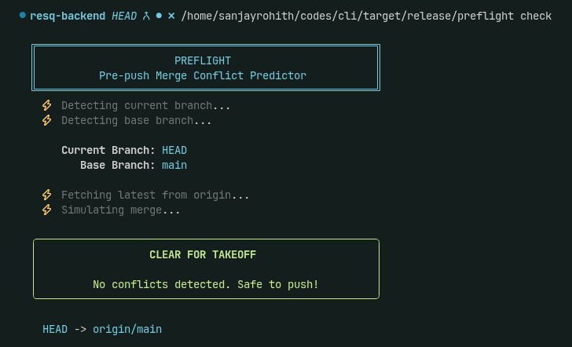

<div align="center">

# ✈️ Preflight

### Know before you push

**Catch merge conflicts _before_ you push — not during CI, not in PR review, not when your teammate pings you at 5pm.**

[](https://crates.io/crates/preflight)
[](#-license)
[](https://www.rust-lang.org)
[](https://git-scm.com)

[Quick Start](#-quick-start) • [Why Preflight](#-why-preflight) • [Install](#-installation) • [Usage](#-usage) • [How It Works](#-how-it-works)

<br/>



</div>

---

## 🛫 The Problem

Every developer knows this pain:

```bash
$ git push origin feature-branch
# ✅ Pushed! Time for coffee ☕

# 20 minutes later...
❌ CI failed: merge conflicts in 4 files
# Or worse — your reviewer finds them
# Or worse still — you find out during a messy rebase
```

By the time conflicts surface, **you've lost all context.** The code is no longer fresh in your head, the CI queue is backed up, and your teammate is blocked. What should've been a 2-minute fix becomes a 30-minute detour.

## 🎯 The Solution

**Preflight tells you the moment a conflict exists — before you push.**

```bash
$ preflight check
```

<table>
<tr>
<td width="50%" valign="top">

**✅ All clear**
```
╭──────────────────────────────╮
│      CLEAR FOR TAKEOFF       │
│                              │
│  No conflicts. Safe to push! │
╰──────────────────────────────╯
```
Push with confidence.

</td>
<td width="50%" valign="top">

**⚠️ Conflicts ahead**
```
╭──────────────────────────────╮
│  HOLD FOR CLEARANCE          │
│                              │
│  Conflicts detected.         │
╰──────────────────────────────╯
  ✗ src/auth.rs
  ✗ src/main.rs
```
Fix now, while context is fresh.

</td>
</tr>
</table>

Fast. Safe. Zero setup. **It never touches your working directory.**

---

## ⏱️ How Preflight Saves You

| Without Preflight | With Preflight |
|:------------------|:---------------|
| 🔴 Push → wait for CI → CI fails | 🟢 Check locally in ~1 second |
| 🔴 Context lost, code gone cold | 🟢 Fix while it's fresh in your head |
| 🔴 Teammates blocked on your branch | 🟢 Team stays unblocked |
| 🔴 Wasted CI minutes and queue time | 🟢 Clean CI runs, every time |
| 🔴 Surprise conflicts mid-rebase | 🟢 Know exactly what will collide |

One command saves you a broken CI run, a context switch, and a frustrating rebase.

---

## 🚀 Quick Start

```bash
# 1. Install
cargo install preflight

# 2. Go to your repo and check
cd your-git-repo
preflight check
```

That's the whole thing. If there's a conflict, you'll know instantly — with the exact files listed.

---

## ✨ Features

- **✈️ Beautiful CLI** — an aviation-themed interface that makes checking conflicts genuinely pleasant
- **⚡ Lightning fast** — powered by Git's native `merge-tree`, typically under 2 seconds
- **🛡️ 100% safe** — read-only. Never touches your working directory, index, or branches
- **📊 Smart stats** — see how far ahead/behind you are, files changed, and line diffs
- **🎯 Accurate** — uses Git's own merge algorithm, so results match a real merge
- **🪝 Hook-ready** — fast enough to run automatically on every push

---

## 📦 Installation

**From crates.io (recommended)**
```bash
cargo install preflight
```

**From source**
```bash
git clone https://github.com/yourusername/preflight
cd preflight
cargo install --path .
```

**Requirements**
- Git **2.38+** — check with `git --version`
- Rust **1.70+** — only needed to build from source

---

## 📖 Usage

### Basic check
```bash
preflight check
```
Checks your current branch against the base branch (auto-detected as `main` or `master`).

### With statistics
```bash
preflight check --stats
```
Adds a detailed breakdown:
- **↑ Ahead** — commits you're ahead of base
- **↓ Behind** — commits base is ahead of you
- **📝 Files changed** — number of modified files
- **± Lines** — insertions and deletions

### Against a custom base branch
```bash
preflight check --base develop
```

### In a script or CI
```bash
preflight check && git push
```
Preflight exits `0` when clean and `1` when conflicts exist, so it composes cleanly with `&&` and CI pipelines.

---

## 🔧 How It Works

Preflight uses Git's native plumbing command `merge-tree` in `--write-tree` mode:

```bash
git merge-tree --write-tree <base-branch> <current-branch>
```

This computes what a merge **would** produce — without actually performing it.

**What happens:**
1. Detects your current branch and the base branch
2. Fetches the latest base from remote (read-only)
3. Simulates the merge using Git's real algorithm
4. Reports any conflicts, file by file

**What never happens:**
- ❌ No working directory changes
- ❌ No index modifications
- ❌ No branch updates
- ❌ No stash operations

> **Why not `git merge --no-commit`?** That still mutates your index and can leave you in a half-merged state. Preflight uses the lower-level plumbing so your repo is guaranteed untouched.

---

## ❓ FAQ

<details>
<summary><b>Does Preflight modify my repository?</b></summary>
<br/>
No. Preflight only reads. Your working directory, index, HEAD, and branches remain completely untouched. This is a hard guarantee.
</details>

<details>
<summary><b>What Git version do I need?</b></summary>
<br/>
Git 2.38.0 or later (October 2022), which introduced the <code>--write-tree</code> flag for <code>merge-tree</code>. Check with <code>git --version</code>.
</details>

<details>
<summary><b>Can I use a base branch other than main?</b></summary>
<br/>
Yes — <code>preflight check --base develop</code> works with any branch.
</details>

<details>
<summary><b>Does it work with remote branches?</b></summary>
<br/>
Yes. Preflight fetches the latest state of the base branch from origin before checking, so you always compare against the most recent remote state.
</details>

<details>
<summary><b>Can I use it in CI?</b></summary>
<br/>
Absolutely. Use the exit codes (0 = clean, 1 = conflicts) in your scripts. JSON output is planned for a future release.
</details>

<details>
<summary><b>Is it fast enough for a git hook?</b></summary>
<br/>
Yes — designed to run in under 2 seconds for typical repos. Automatic hook installation is on the roadmap.
</details>

---

## 🗺️ Roadmap

- [x] **Core conflict detection**
- [x] **Statistics display**
- [ ] **Auto-install git hooks** — `preflight install-hook`
- [ ] **Check against open PRs** — catch conflicts with teammates' branches
- [ ] **JSON output** — stable schema for CI
- [ ] **Config file** — `.preflight.toml` for per-project defaults

---

## 🤝 Contributing

Contributions are welcome! See [CONTRIBUTING.md](CONTRIBUTING.md) to get started.

**Great first issues:**
- Windows testing and support
- Git hook auto-installation
- Config file support
- PR conflict detection

---

## 📄 License

Licensed under either of:

- **MIT License** ([LICENSE-MIT](LICENSE-MIT))
- **Apache License 2.0** ([LICENSE-APACHE](LICENSE-APACHE))

at your option.

---

<div align="center">

**Built with ❤️ by developers, for developers**

[Report a Bug](https://github.com/yourusername/preflight/issues) • [Request a Feature](https://github.com/yourusername/preflight/issues)

<br/>

*Clear skies and clean merges.* ✈️

</div>
